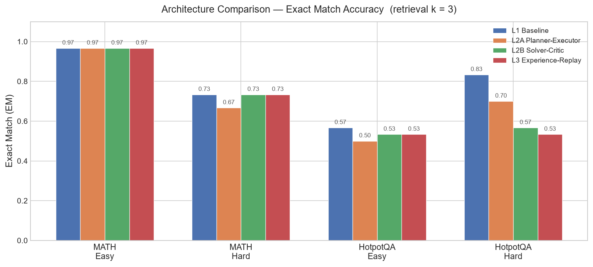
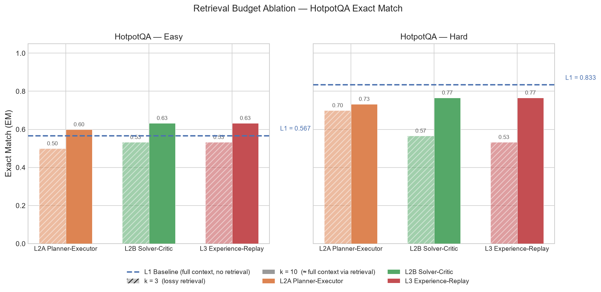
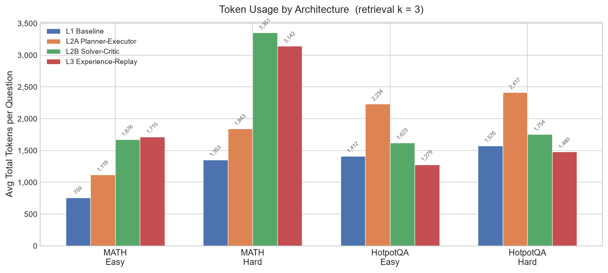

# Comparative Analysis of Agentic Architectures on Reasoning and Information-retrieval Tasks

---

## Abstract

This project empirically investigates *when*, *why*, and *at what token cost* multi-agent scaffolding outperforms a bare single-agent baseline on logical-reasoning and information-seeking tasks. I implement four architectures of increasing complexity in LangGraph — a bare single-agent baseline (L1), a static Planner–Executor (L2A), a cyclic Solver–Critic loop (L2B), and an Experience-Replaying Solver–Critic with local trajectory memory (L3) — and evaluate them on a 4-architecture × 2-domain × 2-difficulty matrix (MATH for deductive reasoning, HotpotQA for multi-hop information seeking), with 30 samples per cell, plus a retrieval-budget ablation (top-*k* = 3 vs. 10) on the information-seeking domain. All agents run on a single shared model (Qwen3.6-27B, served via the ELTE vLLM endpoint), so any performance difference is attributable to architecture rather than model. My central finding is a **negative result with a clear mechanism**: across every cell, multi-agent scaffolding failed to beat the single-agent baseline on accuracy, while generally costing more tokens — up to 2.5× more on MATH hard, where the Solver–Critic loop is most expensive. On MATH the four architectures were statistically indistinguishable (0.967 easy, ~0.67–0.73 hard); on HotpotQA the multi-agent systems initially *underperformed* L1, which I traced to a retrieval-evidence asymmetry — the baseline sees all context paragraphs while the retrieval-based agents see only the top-*k*. A *k*=3→*k*=10 ablation confirmed this diagnosis directly: raising the retrieval budget recovered up to roughly 20 EM points for L2A/L2B/L3 (most cells gaining around 10–20) with L1 unchanged. The experience-replay memory of L3 produced no benefit, because the dominant failure modes (retrieval gaps and surface-form scoring artifacts) are not of the repeatable-reasoning-error type that trajectory memory is designed to fix. I conclude that on tasks a capable mid-sized model already handles, agentic structure buys cost rather than accuracy — and can actively hurt when it introduces an information bottleneck the baseline does not have.

---

## Introduction

Graph-based agent frameworks such as LangGraph, AutoGen, and CrewAI now make it routine to chain several LLM calls into a structured workflow — sequential pipelines, branching logic, reflection cycles, and bounded retries. A recurring observation in recent work is that *how* these calls are wired together can matter as much as the size of the underlying model. Yet most published comparisons pit a single agentic design against a plain, non-agentic model; relatively few keep the model constant and ask which *arrangement of agents* actually performs best, and what that arrangement costs in tokens. This study targets that under-explored question on a compact, tightly controlled set of reasoning and information-retrieval tasks.

A known weakness of monolithic single-agent systems is that, on long-horizon tasks, early errors accumulate because the model treats its own flawed intermediate steps as factual context. Multi-agent systems (MAS) aim to mitigate this by partitioning a workflow into focused subproblems handled by specialized agents — separating planning from execution, or generation from verification. But adding agents is not free: it inflates token usage, adds latency, and introduces coordination failure modes of its own. I therefore built a controlled empirical pipeline to measure *when*, *why*, and *at what token cost* multi-agent scaffolding outperforms a bare single-agent baseline. A central methodological commitment runs through the study: every architecture runs on the **same underlying model with the same prompts where possible**, so that any observed difference isolates the contribution of the architecture itself rather than confounding it with model choice.

I chose two task domains that stress different agentic capabilities while remaining cleanly and deterministically evaluable: deductive arithmetic reasoning (MATH), where the difficulty is multi-step calculation, and multi-hop information seeking (HotpotQA), where the difficulty is finding and combining evidence across documents amid distractors. Around these, the investigation centers on a single overarching question — *under what conditions, and to what measurable degree, does layering additional agents on top of a single-call baseline improve task accuracy, and what is the accompanying cost in token consumption?* — broken into three sub-questions, each paired with a hypothesis fixed before any experiment was run:

- **RQ1 (Task complexity vs. scaffolding).** To what extent does task difficulty determine the performance gap and token-cost trade-off between a bare baseline and scaffolded configurations? *H1:* on easy tasks the baseline matches the multi-agent systems at a fraction of the token cost; on hard tasks, scaffolding becomes necessary to isolate calculation and retrieval errors and prevent error cascade.
- **RQ2 (Decomposition vs. reflection).** Does a dynamic Solver–Critic loop justify its extra token cost over a static Planner–Executor under different iteration caps? *H2:* on hard tasks the Solver–Critic loop achieves significantly higher accuracy than the Planner–Executor, at a higher token cost that scales with the iteration cap.
- **RQ3 (Contextual experience replay).** Can a lightweight trajectory memory of past failure reflections prevent repeated errors and improve efficiency under high distraction? *H3:* caching failure reflections reduces repeated reasoning loops and reflection steps in high-distractor environments.

The result is a hypothesis-testing study in the spirit the assignment encourages. As the Analysis shows, the evidence **refutes the consequential half of H1 and H2** (scaffolding did not overtake the baseline on hard tasks; the critic loop did not beat the planner) and **largely refutes H3** (memory produced no measurable benefit). I report these negative results in full and, more importantly, explain the mechanisms behind each — which is where the study's contribution lies.

---

## Related Work

This project draws on four strands of prior work: agent reasoning loops, multi-agent orchestration, retrieval under context limits, and failure taxonomies.

**Reasoning and reflection loops.** ReAct (Yao et al., 2023, ICLR) interleaves reasoning traces with actions and is the conceptual ancestor of my L1 baseline and the executor in L2A. Chain-of-Thought prompting (Wei et al., 2022, NeurIPS) established that eliciting explicit step-by-step reasoning improves multi-step problem solving, and motivates the deliberate choice to keep that scaffolding *out* of the bare baseline so its contribution can be measured. Reflexion (Shinn et al., 2023, NeurIPS) introduced self-reflection between attempts, in which an agent verbally critiques its own prior output and retries; this directly inspires the L2B Solver–Critic loop and the failure-summarization step in L3. Self-Refine (Madaan et al., 2023, NeurIPS) similarly showed that a single model can iteratively improve its own output through self-generated feedback, providing a second anchor for the critique-and-repair pattern.

**Multi-agent orchestration.** Stateful frameworks — primarily LangGraph (LangChain, 2024), the framework used here — model agent interactions as directed graphs in which nodes are specialized LLM actions and edges dictate state transitions, enabling the cyclic feedback loops and conditional routing my L2B and L3 architectures rely on. AutoGen (Wu et al., 2023) popularized composing multiple conversational agents into cooperative workflows and provides design patterns for the planner/executor and solver/critic splits. Within this design space, the Planner–Executor pattern decomposes a query into a static sequence of steps to reduce context bloat, while the Solver–Critic pattern implements dynamic self-reflection; prior work also notes that flat multi-agent debates can suffer from "forceful agreement" (premature convergence on a wrong answer) or "ending divergence" (drift toward poorer outputs over rounds) — the latter of which I observe directly on binary comparison questions.

**Retrieval and context limits.** Long-horizon execution is constrained by the context window, and retrieval-augmented generation surfaces only relevant passages to stay within it. However, concatenating many documents induces "lost in the middle" attention decay (Liu et al., 2023), where relevant evidence placed mid-context is under-attended. HotpotQA (Yang et al., 2018, EMNLP) was designed precisely to test multi-hop synthesis across documents in a distractor setting, and is my information-seeking benchmark. The retrieval-budget asymmetry I uncover — where a lossy top-*k* retriever handicaps the multi-agent systems relative to a full-context baseline — is a concrete instance of how retrieval design can dominate an architecture comparison.

**Datasets and failure analysis.** The MATH dataset (Hendrycks et al., 2021, NeurIPS) supplies competition-level problems with human-annotated difficulty levels, used here as the reasoning benchmark. For organizing failure analysis I adopt the Multi-Agent System Failure Taxonomy (MAST) (Cemri et al., 2025), which categorizes MAS failures across specification, inter-agent misalignment, and verification — and lets me label observed failures such as ending divergence in a principled way.

Two choices set this study apart from the work above. First, the comparison is *architecture-against-architecture* under a fixed model and shared prompts wherever feasible, isolating the effect of structure rather than ranking foundation models. Second, every result is reported as a paired accuracy-and-cost measurement, so that the conclusions take the form of explicit cost/accuracy trade-offs instead of accuracy figures considered in isolation.

## Methodology

### Architectures

All four architectures share a single custom `EvalState` (a LangGraph `TypedDict`) and the same LLM client; they differ only in node topology and output schema. The state schema is deliberately minimal to avoid unbounded token growth: it carries document *identifiers* rather than raw document text, and accumulates structured `CriticReview` objects in a dedicated reducer list rather than appending verbose conversational history.

**Table 1 — Architecture specifications.**

| Level | Structural design | Components | State management | Communication |
|-------|-------------------|------------|------------------|---------------|
| **L1** | Bare single baseline | Single LLM call | Stateless | None |
| **L2A** | Planner–Executor | Planner, Executor | Stateful (overwrite steps) | Shared state (plan list) |
| **L2B** | Solver–Critic | Solver, Critic | Stateful (reducer list) | Shared state (JSON feedback) |
| **L3** | Experience-replaying Solver–Critic | Solver, Critic, Memory Retriever, Memory Builder | Stateful (hybrid) | Shared state + local prompt injection |

- **L1 — Bare baseline.** A single direct model call prompted to answer and show raw reasoning, with no planning instructions, output schema, or JSON constraints. This guarantees a true un-scaffolded floor against which to measure the contribution of the multi-agent splits.
- **L2A — Planner–Executor.** The planner generates a static sequential list of steps; the executor carries them out (using the retrieval tool on HotpotQA) and synthesizes a final answer, with no feedback loop.
- **L2B — Solver–Critic.** The solver produces a candidate answer; the critic reviews it against a structured `CriticReview` schema and, if it detects an error, routes the state back to the solver for a repair attempt. A hard iteration cap bounds the loop.
- **L3 — Experience-replaying Solver–Critic.** Extends L2B with two memory nodes. A *Memory Retriever* node runs first, checking the incoming query against a local `trajectory_cache.json` of past failure lessons and injecting any relevant lesson into the solver's prompt. A *Memory Builder* node runs only after a successful critic-corrected recovery, summarizing the run's failure-and-fix into a compact lesson appended to the cache. This realizes the optional adaptive-system additions (memory summarization, adaptive strategy, experience replay) without an external vector database.

### Experimental setup

**Model and orchestration.** All agents — solver, executor, planner, critic, and baseline — run on a **single shared model, Qwen3.6-27B**, served via the ELTE Faculty of Informatics vLLM endpoint (OpenAI-compatible API). Using one model for every role is a deliberate design choice: it removes any confound between architecture and model capability, so that an accuracy difference between L1 and L2B can be attributed to the *critic loop* and not to a stronger model hiding inside one branch. Orchestration uses **LangGraph** throughout. A single `llm_call` wrapper is the only point that touches the API; it handles the Qwen3 reasoning-mode quirk by disabling `enable_thinking` whenever a structured JSON schema is requested (thinking mode and structured output conflict on this endpoint), forces an explicit `max_tokens`, and accumulates token usage per call. Sampling temperature is 0.0 for deterministic roles.

**Datasets and difficulty.** I chose two domains to span two of the assignment's task categories — *reasoning* and *information-seeking* — while remaining cleanly and deterministically evaluable. Both are loaded directly from HuggingFace, with a small in-file curated fallback so the suite remains runnable offline.

- **MATH (deductive reasoning)** — HuggingFace `qwedsacf/competition_math`, an active mirror of the original Hendrycks et al. MATH benchmark (the canonical `hendrycks/competition_math` repository is currently disabled by a DMCA notice, so I use this functionally identical mirror). I chose MATH because it provides competition-level problems with *native, human-annotated* difficulty levels (Level 1–5) and objectively checkable answers, which gives an intrinsic difficulty axis rather than a synthetic one. I map **Level 1–2 → easy** and **Level 4–5 → hard**; answers are LaTeX `\boxed{}` expressions, and difficulty manifests as longer multi-step derivations. An earlier pilot used GSM8K, but Qwen3.6-27B saturated it even with injected distractors (the baseline scored 0.96 on "hard"), leaving no headroom for the architectures to differentiate — so I substituted MATH to restore a meaningful difficulty gradient.
- **HotpotQA (multi-hop information seeking, distractor setting)** — HuggingFace `hotpotqa/hotpot_qa`. I chose HotpotQA because it is the canonical multi-hop QA benchmark: each question is paired with a pool of ~10 paragraphs (gold supporting paragraphs plus distractors), and answering requires synthesizing evidence across documents rather than reading it off a single passage — exactly the information-seeking capability I want to stress. **Easy** questions lean single-hop; **hard** questions are multi-hop bridge/comparison types requiring evidence from two paragraphs amid distractors. The retrieval-based agents (L2A/L2B/L3) use a TF-IDF cosine-similarity tool to select the top-*k* paragraphs; the L1 baseline receives the full pool.

This gives two justified difficulty dimensions: **increased task complexity** (MATH Level 1–2 vs. 4–5) and **noisy/ambiguous inputs** (HotpotQA distractor pool and multi-hop chaining).

**Evaluation.** All scoring is deterministic and programmatic — no LLM-as-a-judge — to avoid added cost, latency, and hallucinated judgment.

- *MATH:* extract the last `\boxed{}` from the prediction, normalize the LaTeX, and compare to the gold answer with numeric cross-format matching (so `\frac{1}{2}`, `1/2`, and `0.5` count as equal) and order-insensitive set matching for comma-separated answers. Reported as Exact Match.
- *HotpotQA:* official normalization (lowercase, strip articles/punctuation), then Exact Match and token-level F1. A lightweight safety net takes only the last non-empty line when a prediction exceeds 150 characters, to limit verbose-output artifacts without an extra LLM call. **F1 is treated as the more reliable signal for HotpotQA**, because exact-match heavily penalizes correct-but-over-specified entity answers (see Failure Analysis).

**Metrics.** Per row I record Exact Match, F1 (HotpotQA), total input/output tokens (from API usage metadata), graph steps (state transitions to END), wall-clock seconds, and any error. Steps are deterministic per architecture (L1 = 1, L2A = 2, L2B = 2 + retries, L3 = 3 + retries) and serve as a structural cost signal alongside tokens.

### Experimental matrix and hyperparameter sweeps

The core matrix is **4 architectures × 2 domains × 2 difficulties × 30 samples = 480 base rows**, all run at the default retrieval budget *k* = 3 and iteration cap = 2. The same 30 sampled questions are reused across architectures within each cell, so comparisons are paired. Two sweeps extend the matrix:

- **Retrieval-budget ablation (*k* = 3 vs. 10)** on all four HotpotQA cells for L2A/L2B/L3. At *k* = 10 the retriever returns essentially the entire candidate pool, making the multi-agent systems' information access equivalent to L1's full-context view — i.e. *k* = 10 is the controlled "fair" condition and *k* = 3 is the lossy-retrieval condition.
- **Iteration cap** is recorded for the Solver–Critic loop (cap = N permits N−1 corrective retries; cap = 2 was used for the main matrix).

Wall-clock runtime is reported for completeness but is confounded by variable load on the shared endpoint, so tokens and steps are treated as the primary efficiency metrics.

---

## Experiments

All 22 run configurations (the full matrix plus both *k* settings on HotpotQA) completed with no recorded errors; each cell is a 30-sample run (one row in the L2B HotpotQA-hard *k*=3 cell returned an empty response and is treated as a miss, so that single cell is effectively 29 scored rows out of 30). MATH cells were run at *k* = 3 only (retrieval does not apply to the reasoning domain). The complete numeric results are reproduced in the Results section, and the underlying per-row CSVs and the `summary.txt` aggregation accompany the code repository.

---

## Results

### Headline accuracy (retrieval *k* = 3)

**Figure 1.** Exact-match accuracy by architecture across the four task cells at *k* = 3.

**Table 2 — Exact Match by architecture and cell (*k* = 3).**

| Architecture | MATH easy | MATH hard | HotpotQA easy | HotpotQA hard |
|--------------|-----------|-----------|---------------|---------------|
| L1 baseline | 0.967 | 0.733 | 0.567 | **0.833** |
| L2A Planner–Executor | 0.967 | 0.667 | 0.500 | 0.700 |
| L2B Solver–Critic | 0.967 | 0.733 | 0.533 | 0.567 |
| L3 Experience-Replay | 0.967 | 0.733 | 0.533 | 0.533 |

Two patterns are immediately visible. On **MATH**, all four architectures are essentially tied — identical on easy (0.967) and clustered within one sample on hard (0.667–0.733). On **HotpotQA**, the multi-agent architectures **underperform** the L1 baseline at *k* = 3, dramatically so on the hard cell (L1 0.833 vs. L2B 0.567 vs. L3 0.533).

### Retrieval-budget ablation

**Figure 2.** HotpotQA exact match at *k* = 3 (hatched) vs. *k* = 10 (solid), with the L1 full-context baseline as a dashed reference line.

**Table 3 — HotpotQA EM / F1 at *k* = 3 vs. *k* = 10.**

| Architecture | Easy *k*=3 | Easy *k*=10 | Hard *k*=3 | Hard *k*=10 |
|--------------|-----------|------------|-----------|------------|
| L2A | 0.500 / 0.616 | 0.600 / 0.738 | 0.700 / 0.717 | 0.733 / 0.814 |
| L2B | 0.533 / 0.642 | 0.633 / 0.720 | 0.567 / 0.667 | 0.767 / 0.867 |
| L3 | 0.533 / 0.642 | 0.633 / 0.720 | 0.533 / 0.589 | 0.767 / 0.867 |
| *L1 (full context)* | *0.567 / 0.675* | — | *0.833 / 0.934* | — |

Raising the retrieval budget from 3 to 10 lifts every multi-agent architecture on HotpotQA — most strikingly L2B and L3 on the hard cell, which jump from 0.567/0.533 to **0.767**. This closes most of the gap to the L1 baseline and confirms that the *k* = 3 underperformance was driven by a retrieval bottleneck, not by the architectures themselves. Even at *k* = 10, however, the multi-agent systems only *reach* the baseline on easy and remain slightly below it on hard — scaffolding still does not produce a net accuracy gain.

### Token efficiency

**Figure 3.** Average total tokens per question by architecture and cell (*k* = 3).

**Table 4 — Average total tokens per question (*k* = 3).**

| Architecture | MATH easy | MATH hard | HotpotQA easy | HotpotQA hard |
|--------------|-----------|-----------|---------------|---------------|
| L1 | 760 | 1,354 | 1,413 | 1,576 |
| L2A | 1,119 | 1,844 | 2,235 | 2,417 |
| L2B | 1,677 | 3,352 | 1,623 | 1,755 |
| L3 | 1,716 | 3,143 | 1,279 | 1,480 |

The cost ordering is consistent with the structural complexity: every step up the architecture ladder adds tokens. On MATH hard, L2B consumes **2.5× the tokens of L1** (3,352 vs. 1,354) for *identical* accuracy (0.733 vs. 0.733). The one exception is informative: on HotpotQA, L3's *output* tokens are very low and its totals dip below L2A's, because its memory-conditioned solver tends to emit terse answers — but this terseness buys no accuracy.

### Steps and critic activity

L1 always executes 1 step and L2A always 2, by construction. L2B's mean steps stay near 2.0–2.27, indicating the critic rarely triggers a retry — it fires meaningfully only on HotpotQA hard (2.27) and essentially never on MATH easy (2.00). L3 runs at 3.0–3.17 steps on HotpotQA, confirming its memory-retrieve and memory-build nodes are actually executing rather than being skipped.

---

## Analysis

### RQ1 — Scaffolding did not rescue hard tasks; it mostly added cost

H1 predicted that on hard tasks, scaffolding would become *necessary*. The data refute this. On **MATH hard**, L1, L2B, and L3 all score exactly 0.733 and L2A scores *lower* (0.667), while token cost rises up to 2.5×. The single-agent baseline, given the full problem, already extracts and chains the arithmetic competently; decomposing the work across a planner or wrapping it in a critic loop adds coordination overhead and a second failure surface without adding capability. This mirrors the clearest pattern in the matrix: **on a task a capable mid-sized model can already do, agentic structure buys tokens, not accuracy.** The easy half of H1 holds — the baseline matches the multi-agent systems on easy tasks at a fraction of the cost — but the consequential half (scaffolding required on hard tasks) is false for this model and these tasks.

### RQ2 — The critic loop did not beat the planner, and sometimes hurt

H2 predicted Solver–Critic would significantly outperform Planner–Executor on hard tasks. It did not. On MATH hard the two are within one sample (L2B 0.733 vs. L2A 0.667, i.e. L2B is marginally *higher* but inside noise), and on HotpotQA hard at the fair *k* = 10 budget they are very close (0.767 vs. 0.733). The mechanism is visible in the step counts: the critic rarely fires (mean steps ≈ 2.0–2.27), so for most rows L2B *is* L2A plus an idle critic call — extra tokens, no behavioral change. Worse, when the critic does fire on HotpotQA, it sometimes induces **regression**: on binary "are both X and Y …?" comparison questions, the solver's correct first answer ("no") is flagged by a critic that cannot locate explicit contradicting evidence in its retrieval window, and the retry flips it to a wrong "yes" (a concrete instance of *ending divergence*, MAST-3.3). The critic loop's value is therefore bounded by the quality of the evidence it can verify against; with noisy TF-IDF retrieval over free text, verification is itself unreliable, and a loop built on unreliable verification cannot consistently improve answers.

### RQ3 — Experience replay produced no benefit, and the reason is structural

H3 predicted trajectory memory would prevent repeated reasoning errors. Across every cell, L3 either ties or slightly trails L2B (e.g. HotpotQA hard *k* = 3: 0.533 vs. 0.567), and at *k* = 10 the two are identical (0.767/0.867). The failure analysis explains why: the memory is designed to cache and replay fixes for **repeatable reasoning mistakes on similar question structures**, but those were not the dominant failure modes in this study. The dominant modes were retrieval-infrastructure gaps and surface-form scoring artifacts — neither of which is learnable from a cached lesson. L3's memory nodes ran (steps ≈ 3), so the null result reflects a genuine mismatch between the mechanism and the error distribution, not a non-executing feature. This is itself a useful design lesson: experience replay only pays off when the workload actually contains recurring, structurally-similar reasoning traps.

### The retrieval-evidence asymmetry — the study's key mechanistic finding

The HotpotQA underperformance at *k* = 3 was initially surprising, but the ablation pins down its cause precisely. L1 and the retrieval agents were not solving the same task: L1 receives **all** candidate paragraphs (and merely has to ignore distractors, which a capable model does well), whereas L2A/L2B/L3 see only the top-*k* the TF-IDF retriever selected. When *k* = 3, the retriever frequently misses a required bridge paragraph, and the agent then either correctly refuses ("the provided context does not contain …") or hallucinates from incomplete evidence. The retriever, in other words, was *removing* information rather than adding intelligence. Raising *k* to 10 — equalizing information access — recovered as much as ~20 EM points on the hard cell (and around 10 points on easy) and erased most of the gap (Figure 2). The broader lesson is that a retrieval step is an architectural choice bolted onto the Solver–Critic pattern, not an inherent part of it, and a lossy retriever can dominate the entire architecture comparison if information access is not held equal across conditions.

---

## Failure Analysis

Inspecting the failing HotpotQA rows reveals four distinct modes, ranked by frequency and architectural significance.

**Mode 1 — Surface-form EM mismatch (affects all architectures equally).** A large share of EM = 0 predictions are factually correct answers that differ only in surface form: gold "Mumbai" vs. "Mumbai, Maharashtra"; gold "director" vs. "film director"; gold "1969 until 1974" vs. "1969-1974". These score F1 ≈ 0.5–0.8, confirming partial overlap, and they affect L1 exactly as much as the multi-agent systems. This is an evaluation artifact, not an architecture failure, and it is the main reason F1 is the more trustworthy HotpotQA metric and why all absolute EM numbers are suppressed uniformly (leaving the *relative* ordering intact).

**Mode 2 — Retrieval gap (L2A/L2B/L3 only).** With *k* = 3, the TF-IDF retriever often misses a required paragraph for multi-hop questions, especially when the question names one entity (e.g. "Kasper Schmeichel") but the needed paragraph concerns a related one ("Peter Schmeichel"). The model then correctly refuses. L1 never hits this mode because it sees all paragraphs. The *k* = 10 ablation confirms the diagnosis: every retrieval agent gains on hard questions when the budget is raised, while L1 is unchanged. This is the dominant driver of the multi-agent underperformance.

**Mode 3 — Critic-induced regression on binary questions (L2B/L3).** On yes/no comparison questions, the solver's correct "no" is flagged by a critic that cannot find explicit contradicting evidence in its small retrieval window, and the retry flips it to a wrong "yes" (e.g. "Are both Cypress and Ajuga genera?" → gold "no", L2B "yes" after two retry cycles). Confirming a *negative* requires evidence of the *absence* of a property, which TF-IDF — biased toward vocabulary overlap with the question — retrieves poorly. This is the *ending divergence* failure (MAST-3.3): feedback iterations degrade a near-correct draft.

**Mode 4 — Multi-hop chaining error (all architectures).** Some failures show the model resolving the first hop but not the second: "What year was the *brother* of this first-round draft pick … drafted?" → gold 2003, predicted 1999 (the pick's own draft year). L1 fails this too, so it is a reasoning-depth limitation, not a retrieval-budget one — answering requires retrieving a page for an entity the question never names, which neither full context nor a critic cycle supplies.

**Cross-cutting: why L3's memory does not help.** None of the four modes is the kind of repeatable, structurally-similar reasoning error that trajectory replay can fix. Modes 1 and 4 are not learnable from examples (they need a different metric or genuinely deeper retrieval); Mode 2 is an infrastructure gap no amount of cycling repairs; Mode 3 is *worsened* by more critic cycles. This fully explains the flat L3-vs-L2B comparison.

---

## Limitations and Future Directions

Several limitations bound the scope of these conclusions and suggest concrete next steps.

**Single model and single seed.** Every result is conditional on one model, Qwen3.6-27B, sampled at temperature 0 with a single run per cell. A capable 27B model is arguably the wrong capability regime to reveal architectural benefits — the bare baseline is simply too strong on these benchmarks for scaffolding to add headroom. The most informative follow-up would be to repeat the entire matrix on a deliberately weaker model, where the single-agent baseline has genuine room to fail and decomposition or reflection could plausibly close the gap. Adding repeated trials per cell (rather than a single pass) would also let me attach confidence intervals and distinguish real differences from sampling noise, several of which currently sit within one or two samples.

**Sample size and statistical resolution.** Thirty samples per cell is enough to expose large effects (the retrieval-budget gap, the MATH-hard plateau) but too small to resolve differences of a few percentage points. Claims such as "L2B is marginally higher than L2A on MATH hard" should be read as suggestive, not established; a larger n would be required to make them rigorous.

**Lossy TF-IDF retrieval.** The retriever is a simple TF-IDF cosine-similarity selector, which the failure analysis shows performs poorly precisely on the multi-hop questions where a related-but-unnamed entity must be found. This both handicapped the multi-agent systems at low *k* and limited the critic's ability to verify answers against retrieved evidence. Replacing TF-IDF with a dense embedding retriever (or a learned multi-hop retriever) is the change most likely to let the retrieval-based architectures compete with — and possibly exceed — the full-context baseline, and would cleanly separate "architecture is unhelpful" from "retrieval is the bottleneck."

**Evaluation metric sensitivity.** Exact match systematically penalizes correct-but-over-specified answers on HotpotQA (Failure Mode 1), which is why F1 was treated as the more reliable signal. A more semantically-aware scorer (or supporting-fact–level Joint F1) would reduce this artifact, though at the cost of additional implementation and, for any LLM-based scorer, the hallucination risk this study deliberately avoided.

**Two task domains, two difficulty levels.** The conclusions are drawn from a reasoning domain and an information-seeking domain; they may not transfer to interactive or planning/coordination tasks, where long horizons and delayed feedback could change the calculus and make scaffolding more clearly worthwhile. Extending the matrix to such a domain is the broadest avenue for future work.

---

## Conclusion

I built four LangGraph architectures of increasing complexity, ran them on a controlled 4×2×2 matrix plus a retrieval-budget ablation, all on a single shared 27B model, and tested three pre-registered hypotheses. The headline outcome is a **clean, mechanistically-explained negative result**:

1. **More architecture bought cost, not accuracy.** On MATH, all four architectures tied while tokens rose up to 2.5×; on HotpotQA, the multi-agent systems never exceeded the single-agent baseline. For tasks a capable mid-sized model already handles in one shot, scaffolding's main effect was overhead.
2. **The critic loop did not justify itself here.** It rarely fired, and when it did over noisy free-text evidence it could regress correct answers — bounded by the quality of what it could verify against, not by the loop itself.
3. **Experience replay added nothing**, because the workload's dominant failures (retrieval gaps, surface-form artifacts) are not the recurring reasoning traps memory is designed to catch.
4. **The most actionable finding is methodological:** a retrieval step bolted onto a multi-agent pattern can dominate the whole comparison. My *k*-ablation showed that most of the multi-agent "deficit" on HotpotQA was an information-access asymmetry, not an architectural one — and equalizing access (k=10) erased most of it.

The broad design lesson is that **agentic complexity should be matched to the failure modes a task actually exhibits, and to a model-capability regime where the baseline genuinely struggles.** Reflection helps only when verification is reliable; memory helps only when errors recur; decomposition helps only when a single call would otherwise overflow. None of those conditions held strongly for a capable 27B model on these benchmarks — which is exactly why the negative result is informative rather than disappointing. It delineates the conditions under which the considerable cost of multi-agent scaffolding is, and is not, worth paying. The Limitations section above outlines the changes — a weaker base model, a stronger retriever, wider sweeps — most likely to shift that balance in scaffolding's favor.

---

### Reproducibility note

All code is implemented in LangGraph against the ELTE Qwen3.6-27B vLLM endpoint, with a single `llm_call` wrapper, deterministic programmatic scorers, offline dataset fallbacks, and per-row CSV logging. The full results matrix is aggregated in `results/summary.txt`, the three figures are generated from the raw per-row CSVs, and every reported cell is a 30-sample run with no recorded errors (a single row in one cell returned an empty response and is scored as a miss).

---

## References

- Cemri, M. et al. (2025). *Why Do Multi-Agent LLM Systems Fail?* (Multi-Agent System Failure Taxonomy, MAST).
- Hendrycks, D. et al. (2021). *Measuring Mathematical Problem Solving With the MATH Dataset.* NeurIPS.
- LangChain (2024). *LangGraph: Stateful, Multi-Actor Applications with LLMs.* Framework documentation.
- Liu, N. F. et al. (2023). *Lost in the Middle: How Language Models Use Long Contexts.*
- Madaan, A. et al. (2023). *Self-Refine: Iterative Refinement with Self-Feedback.* NeurIPS.
- Shinn, N. et al. (2023). *Reflexion: Language Agents with Verbal Reinforcement Learning.* NeurIPS.
- Wei, J. et al. (2022). *Chain-of-Thought Prompting Elicits Reasoning in Large Language Models.* NeurIPS.
- Wu, Q. et al. (2023). *AutoGen: Enabling Next-Gen LLM Applications via Multi-Agent Conversation.*
- Yang, Z. et al. (2018). *HotpotQA: A Dataset for Diverse, Explainable Multi-hop Question Answering.* EMNLP.
- Yao, S. et al. (2023). *ReAct: Synergizing Reasoning and Acting in Language Models.* ICLR.
